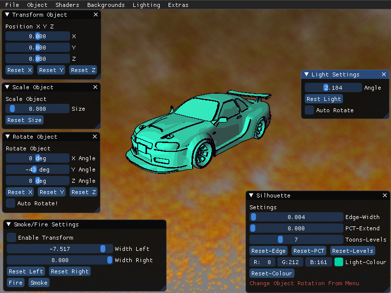

# COMP 3015
**COMP3015-Coursework2**

This project was created using Visual Studio Version 16.9.4.

This product is unique as it shows multiple shader implementation, customisable features & Object/texture changing. I got this idea when creating objects in blender, as I thought it would be beneficial to see how the model would look without having to take a long time to set it up in another program. The classes’ function but being spilt up, where they can be called when required, being as efficient as possible. Code duplication has also tried to be kept to a minimum. This project started with a template in which I build upon over the time!

I believe I have achieved my goal, where this program uses multiple shaders, where there are mixing of complex shaders, using Fragment, vertex, and geometry methods. If I were to complete this task again, I feel like there are some buffers in which I could adapt to minimise potential duplication of code.

    
    
    

**How To Use**
* Use Menu to navigate through multiple shaders.
* Each menu has a drop down in which you can select to use.
* Select backgrounds if you want, some will not work on shaders as they are not designed to.
* Smoke/Fire may not load correctly on incompatible shaders, just turn off and back on again and should be fine!
* Most shaders will come with a GUI! you can change settings for the specific shader through this!
* Light, Rotation/Position/Scale can also be enabled for most shaders, with live updates!
* Open a File, some examples are named!

**How To Use .EXE**
* Simply double click "Project_Template.exe" and the program will run!
* place any textures/objects you want in the media folder!
* Now inspect your model in different shaders!

**How To Use Visual Studio**
* Double lick "Project_Template.sln"
* This will open Visual Studio
* Click debug and inspect your object!

**Please note:**
* To Use Custom Object Particle Effect, Go into Wireframe then Select Custom OBJ Particle system.
* There are dividers in the Shaders Dropdown menu, this indicates when different models need to be reloaded, so a second delay can occur.
* Loading Night Vision required regeneration of Noise texture, which can also take a second or two to load.
* Loading incorrect file names will cause a crash, this is due to the Try Catches built into the program already.

**YouTube Review** 
The Below link takes you to a YouTube review, going over further sections on *how the program works*, *issues**. 
[YouTube Report](https://www.youtube.com/watch?v=wmML_VfguK0&ab_channel=NickClothier)

**GitHub** 
The below link goes to the GitHub used for this project!
[GitHub Repo](https://github.com/Nick1441/COMP3015-CW2)