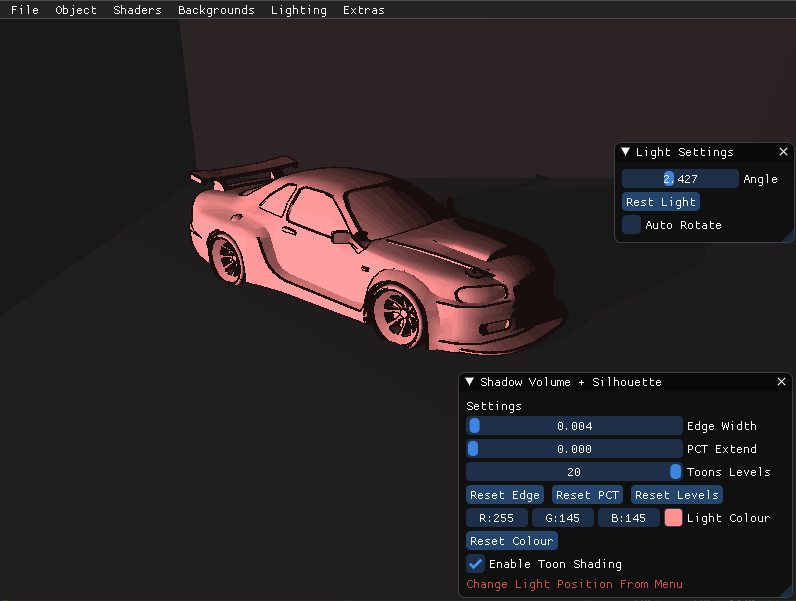
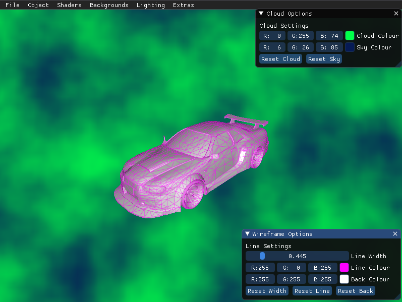

# COMP 3015
**COMP3015-Coursework2**

This project was created using Visual Studio
This Aim *Trainer* is perfect for practising  your aim and reflexes! Within the given 60 Seconds, try to score as many targets as possible! Quick reactions are key here, as the target will move & Scale with each hit! Accuracy also plays a key part in this, as each target can score between 1 & 3 points each, depending on how close you get to the target! With a Calm and warm environment, the game uses multiple features, such as **Shading on the Environment** , **Custom Objects** & **Animations!**

    
    
    

**How To Use**
* Use Menu to navigate through multiple shaders.
* Each menu has a drop down inwhich you can select to use.
* Select backgrounds if you want, some will not work on shaders as they are not designed to.
* Smoke/Fire may not load correctly on incompatable shaders, just turn off and back on again and should be fine!
* Most shaders will come with a GUI! you can change settings for the specific shader through this!
* Light, Rotation/Postion/Scale can also be eneabled for most shaders, with live updates!
* Open a File, some examples are named!

**How To Use .EXE**
* Simply double click "Project_Template.exe" and the program will run!
* place any textures/objects you want in the media folder!
* Now inspect your model in differnt shaders!

**How To Use Visual Studio**
* Double lick "Project_Template.sln"
* This will open Visual Studio
* Click debug and inspect your object!

**Please note:**
* To Use Custom Object Particle Effect, Go into Wireframe then Select Custom OBJ Particle system.
* There are dividers in the Shaders Dropdown menu, this indicates when differnt models need to be reloaded, so a second delay can occour.
* Loading Night Vision required regeneration of Noise texture, which can also take a second or two to load.
* Loading incorrect file names will cause a crash, this is due to the TryCatches built into the program already.

**YouTube Review** 
The Below link takes you to a YouTube review, going over further sections on *how the program works*, *issues**. 
[YouTube Report](https://www.youtube.com/watch?v=wmML_VfguK0&ab_channel=NickClothier)

**GitHub** 
The below link goes to the GitHub used for this project!
[YouTube Report](https://youtu.be/F2sJP04pKJg)